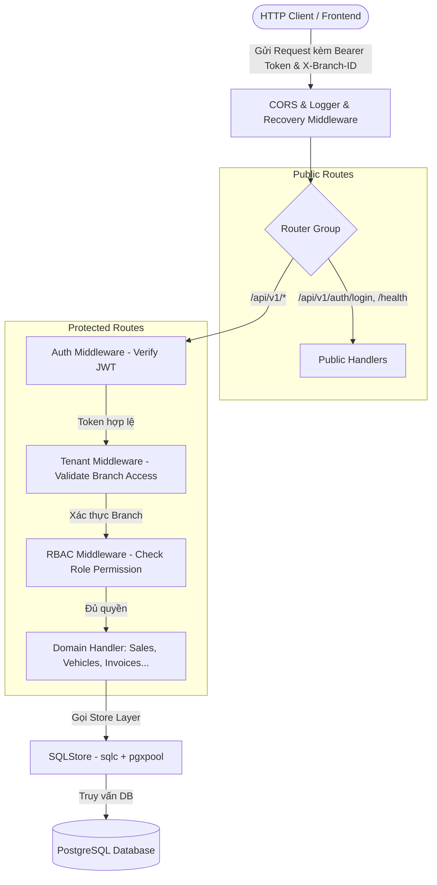

# Kế Hoạch 04: Tích Hợp Gin Web Framework, Router & Middleware Xác Thực (JWT + RBAC + Multi-Tenant)

## 1. Đánh Giá: Có Nên Tích Hợp Gin Không?
**Khuyến nghị: RẤT NÊN DÙNG GIN** (Đã triển khai hoàn tất).
- **Hiệu năng & Tốc độ**: Gin sử dụng Radix Tree Router cho tốc độ routing cực nhanh và tốn ít bộ nhớ.
- **Hệ thống Middleware mạnh mẽ**: Cung cấp `gin.HandlerFunc`, `c.Next()`, `c.AbortWithStatusJSON()` giúp nhúng luồng xác thực JWT, phân quyền RBAC (`superadmin`, `branch_manager`, `salesperson`,...) và trích xuất `branch_id` một cách tường minh, dễ đọc.
- **Tự động Binding & Validation**: Tích hợp sẵn `go-playground/validator/v10` (`binding:"required,email"`, `binding:"required,uuid"`), tự động kiểm tra tính hợp lệ của request payload.
- **Hệ sinh thái chuẩn**: Dễ dàng viết unit test với `httptest.NewRecorder()` và tích hợp mượt mà với `*db.SQLStore` do `sqlc` sinh ra.

---

## 2. Kiến Trúc Luồng Xử Lý Request (Request Pipeline)

---

## 3. Ma Trận Phân Quyền RBAC (Role-Based Access Control)

Dựa trên thiết kế trường `role` trong bảng `users` ([`careerpdoc.md`](../careerpdoc.md)):

| Phân hệ / Tài nguyên | `superadmin` | `branch_manager` | `salesperson` | `accountant` | `mechanic` |
|---|:---:|:---:|:---:|:---:|:---:|
| **Quản lý Chi nhánh & Phòng ban** | Toàn quyền (Tất cả) | Xem chi nhánh mình | Xem chi nhánh mình | Xem chi nhánh mình | Xem chi nhánh mình |
| **Quản lý Nhân sự & User** | Toàn quyền | Quản lý nhân viên chi nhánh | Không có quyền | Không có quyền | Không có quyền |
| **Danh mục xe & Kho xe** | Toàn quyền | Toàn quyền chi nhánh | Xem kho xe, đặt xe | Xem thông tin xe | Xem thông tin xe |
| **CRM Leads & Bán xe (Orders/Contracts)**| Toàn quyền | Xem/Duyệt đơn | Tạo Lead, Bán xe, Tạo Hợp đồng | Xem hợp đồng, đơn hàng | Không có quyền |
| **Hóa đơn & Dòng tiền (Invoices/Tx)** | Toàn quyền | Xem báo cáo tài chính | Xem hóa đơn đơn xe | Tạo/Duyệt Hóa đơn, Ghi nhận TT | Xem hóa đơn sửa chữa |
| **Dịch vụ & Sửa chữa (Repair Orders)** | Toàn quyền | Xem báo cáo dịch vụ | Xem trạng thái xe khách | Xuất hóa đơn dịch vụ | Tạo lệnh SC, sửa chữa, phụ tùng |

---

## 4. Các Module Đã Xây Dựng

### 🔐 Authentication & Security Core
- [`BE/internal/util/password.go`](file:///d:/project/bad-idea/car-erp/BE/internal/util/password.go): Băm & kiểm tra mật khẩu bằng `bcrypt`.
- [`BE/internal/token/maker.go`](file:///d:/project/bad-idea/car-erp/BE/internal/token/maker.go), [`BE/internal/token/jwt_maker.go`](file:///d:/project/bad-idea/car-erp/BE/internal/token/jwt_maker.go), [`BE/internal/token/payload.go`](file:///d:/project/bad-idea/car-erp/BE/internal/token/payload.go): Quản lý tạo và xác thực Token JWT với `golang-jwt/jwt/v5`.

### 🛡️ API Middlewares
- [`BE/internal/api/middleware/auth.go`](file:///d:/project/bad-idea/car-erp/BE/internal/api/middleware/auth.go): Xác thực Token JWT từ `Authorization: Bearer <token>`.
- [`BE/internal/api/middleware/rbac.go`](file:///d:/project/bad-idea/car-erp/BE/internal/api/middleware/rbac.go): Kiểm tra Role của User có nằm trong danh sách cho phép không.
- [`BE/internal/api/middleware/tenant.go`](file:///d:/project/bad-idea/car-erp/BE/internal/api/middleware/tenant.go): Kiểm soát phân vùng dữ liệu theo `branch_id`.
- [`BE/internal/api/middleware/cors.go`](file:///d:/project/bad-idea/car-erp/BE/internal/api/middleware/cors.go): Cấu hình CORS an toàn cho Frontend.

### 🌐 HTTP Handlers & Server Setup
- [`BE/internal/api/response/response.go`](file:///d:/project/bad-idea/car-erp/BE/internal/api/response/response.go): Chuẩn hóa cấu trúc JSON response.
- [`BE/internal/api/handler/auth_handler.go`](file:///d:/project/bad-idea/car-erp/BE/internal/api/handler/auth_handler.go): Login, Get Me.
- [`BE/internal/api/handler/branch_handler.go`](file:///d:/project/bad-idea/car-erp/BE/internal/api/handler/branch_handler.go): CRUD Branches.
- [`BE/internal/api/server.go`](file:///d:/project/bad-idea/car-erp/BE/internal/api/server.go): Khởi tạo Gin Engine, Router groups.
- [`BE/cmd/server/main.go`](file:///d:/project/bad-idea/car-erp/BE/cmd/server/main.go): Tích hợp Server Gin và Graceful Shutdown.

---

## 5. Kết Quả Kiểm Thử (Verification Results)
- **Token Unit Tests** ([`BE/internal/token/jwt_maker_test.go`](file:///d:/project/bad-idea/car-erp/BE/internal/token/jwt_maker_test.go)): PASS (Tạo token, hết hạn token, token không hợp lệ).
- **Middleware Unit Tests** ([`BE/internal/api/middleware/auth_test.go`](file:///d:/project/bad-idea/car-erp/BE/internal/api/middleware/auth_test.go)): PASS (Auth Bearer Token, RBAC Role kiểm tra quyền).
- **Integration API Tests** ([`BE/internal/api/server_test.go`](file:///d:/project/bad-idea/car-erp/BE/internal/api/server_test.go)): PASS (Healthcheck, Tạo chi nhánh phân quyền RBAC: superadmin vs salesperson, phân trang danh sách chi nhánh).
