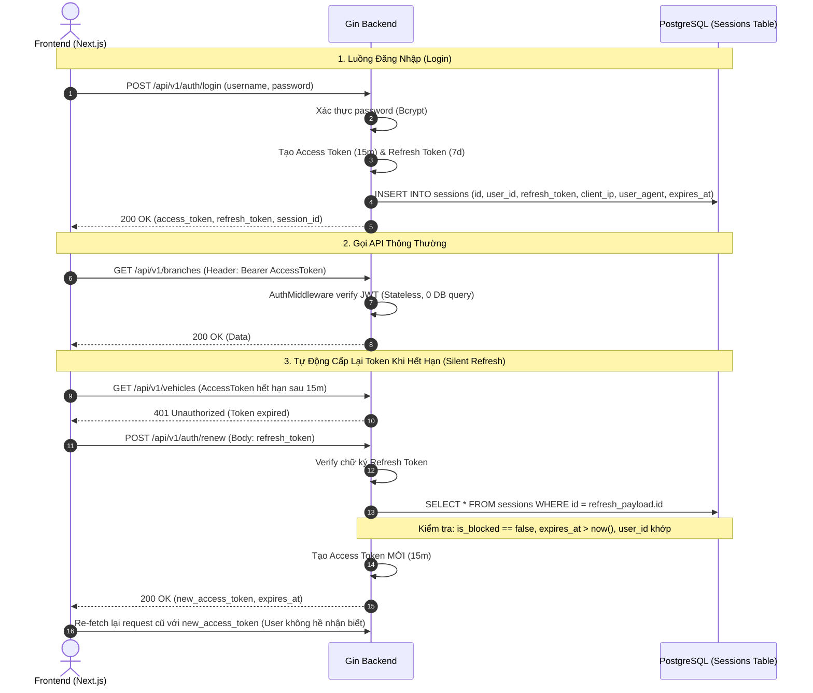

# Kế Hoạch 05: Cơ Chế Refresh Token & Quản Lý Phiên Đăng Nhập (Session Management)

## 1. Bối Cảnh & Mục Tiêu Bảo Mật Hệ Thống Car ERP
Trong hệ thống Automotive ERP:
- Nhân viên bán hàng, cố vấn dịch vụ, kế toán làm việc liên tục suốt ngày dài (8-10 tiếng). Nếu token hết hạn sau 15 phút mà bắt đăng nhập lại sẽ gây gián đoạn công việc nghiêm trọng.
- Tuy nhiên, nếu đặt Access Token sống quá lâu (7-30 ngày), khi token bị lộ hoặc nhân viên bị sa thải, hệ thống không thể thu hồi quyền truy cập ngay lập tức.
- **Giải pháp chuẩn công nghiệp**: Mô hình **Dual Token (Access Token ngắn hạn + Refresh Token có trạng thái trong DB Sessions)**.

---

## 2. So Sánh Hai Loại Token

| Đặc tính | Access Token | Refresh Token |
|---|---|---|
| **Thời hạn sống (TTL)** | Ngắn hạn: `15 phút` | Dài hạn: `7 ngày` |
| **Kiểm tra trạng thái (State)** | **Stateless**: Không query DB, verify bằng chữ ký bí mật trong microsecond | **Stateful**: Lưu và kiểm tra trong bảng `sessions` của PostgreSQL |
| **Mục đích** | Đính kèm trong mọi API Request (`Authorization: Bearer ...`) | Chỉ dùng duy nhất khi gọi endpoint `/api/v1/auth/renew` để cấp lại Access Token |
| **Khả năng thu hồi (Revoke)** | Hết hạn tự nhiên sau TTL | Có thể thu hồi tức thì (`is_blocked = true` hoặc Logout) |

---

## 3. Kiến Trúc Luồng Hoạt Động (Architecture Flow)

---

## 4. Các Thành Phần Đã Triển Khai

### 🗄️ Database Migration
- **UP**: [`BE/db/migration/000002_add_sessions.up.sql`](file:///d:/project/bad-idea/car-erp/BE/db/migration/000002_add_sessions.up.sql) (Đã migrate lên DB test thành công).
- **DOWN**: [`BE/db/migration/000002_add_sessions.down.sql`](file:///d:/project/bad-idea/car-erp/BE/db/migration/000002_add_sessions.down.sql).

### 📝 SQLC Queries
- [`BE/db/query/sessions.sql`](file:///d:/project/bad-idea/car-erp/BE/db/query/sessions.sql): `CreateSession`, `GetSession`, `BlockSession`, `DeleteSession`.
- [`BE/db/sqlc/sessions.sql.go`](file:///d:/project/bad-idea/car-erp/BE/db/sqlc/sessions.sql.go): Code Go do sqlc sinh tự động.

### 🌐 Endpoints & Handlers
- [`BE/internal/api/handler/auth_handler.go`](file:///d:/project/bad-idea/car-erp/BE/internal/api/handler/auth_handler.go):
  - `POST /api/v1/auth/login`: Cấp Access Token (15m) + Refresh Token (7d) và lưu session.
  - `POST /api/v1/auth/renew`: Xác thực Refresh Token và cấp Access Token mới.
  - `POST /api/v1/auth/logout`: Khóa session (`is_blocked = true`).
  - `GET /api/v1/auth/me`: Lấy thông tin user hiện tại.
- [`BE/internal/api/server.go`](file:///d:/project/bad-idea/car-erp/BE/internal/api/server.go): Đăng ký routes và cấu hình thời hạn token.

---

## 5. Kết Quả Kiểm Thử Tự Động (Integration Tests)
Đã kiểm thử toàn bộ luồng trong [`BE/internal/api/server_test.go`](file:///d:/project/bad-idea/car-erp/BE/internal/api/server_test.go):
- **`TestAuth_Login_RenewToken_Logout_Flow`**: **PASS** (0.22s)
  1. Đăng nhập tạo Access Token và Refresh Token thành công.
  2. Dùng Access Token gọi `GET /api/v1/auth/me` thành công.
  3. Dùng Refresh Token gọi `POST /api/v1/auth/renew` nhận Access Token mới thành công.
  4. Đăng xuất `POST /api/v1/auth/logout` khóa session thành công.
  5. Thử renew lại với session đã bị khóa trả về `403 Forbidden` chính xác.
