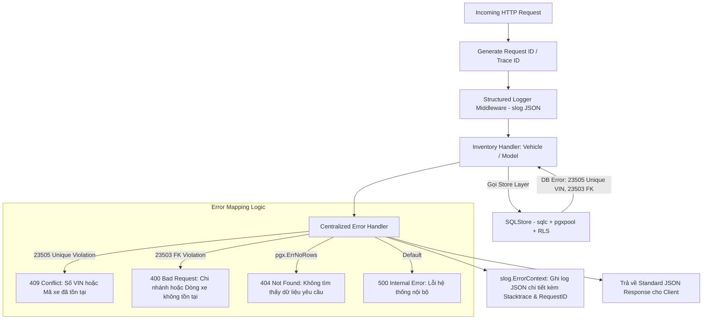

# Kế Hoạch 07: Module Inventory (Dòng Xe & Kho Xe Vật Lý) và Centralized Error Handling & Structured Logging

## 1. Mục Tiêu & Bối Cảnh Nghiệp Vụ
- **Module Inventory**: Là module cốt lõi của hệ thống Automotive ERP quản lý 2 thực thể:
  1. **Vehicle Models (Danh mục dòng xe)**: Model định nghĩa từ hãng (Toyota Camry 2.5Q, VinFast VF8...), lưu thông số kỹ thuật JSONB (Dung tích động cơ, hộp số, options...) dùng chung toàn hệ thống.
  2. **Vehicles (Kho xe vật lý)**: Từng chiếc xe thực tế trong kho gắn với **Số VIN (Vehicle Identification Number) duy nhất**, màu ngoại thất/nội thất, giá nhập và trạng thái kho (`IN_TRANSIT`, `IN_STOCK`, `RESERVED`, `SOLD`, `MAINTENANCE`), được bảo vệ bằng **PostgreSQL RLS** theo từng chi nhánh.
- **Centralized Error Handling & Structured Logging**:
  - Tự động map mã lỗi PostgreSQL từ `pgconn.PgError` (Unique Violation `23505`, Foreign Key `23503`, No Rows `pgx.ErrNoRows`) sang mã HTTP và thông điệp tiếng Việt thân thiện.
  - Tích hợp chuẩn **`log/slog`** (Go 1.21+) ghi log có cấu trúc dạng JSON phục vụ Cloud Observability (AWS CloudWatch, Datadog, ELK).

---

## 2. Kiến Trúc Xử Lý Lỗi & Structured Logging

---

## 3. Các Module Đã Triển Khai

### 🪵 Structured Logging & Centralized Error Handling
- [`BE/internal/logger/logger.go`](file:///d:/project/bad-idea/car-erp/BE/internal/logger/logger.go): Khởi tạo `slog.Logger` JSON và Middleware `StructuredLoggerMiddleware` ghi log `request_id`, `latency`, `status`, `client_ip`.
- [`BE/internal/api/httperr/httperr.go`](file:///d:/project/bad-idea/car-erp/BE/internal/api/httperr/httperr.go): Hàm `HandleDBError` tự động bắt `pgconn.PgError` (Unique Violation `23505` ➡️ `409 Conflict`, Foreign Key `23503` ➡️ `400 Bad Request`, `pgx.ErrNoRows` ➡️ `404 Not Found`).

### 📝 SQLC Queries & Generation
- [`BE/db/query/vehicle_models.sql`](file:///d:/project/bad-idea/car-erp/BE/db/query/vehicle_models.sql): `CreateVehicleModel`, `GetVehicleModel`, `ListVehicleModels`, `ListVehicleModelsByMake`, `UpdateVehicleModel`, `DeleteVehicleModel`.
- [`BE/db/query/vehicles.sql`](file:///d:/project/bad-idea/car-erp/BE/db/query/vehicles.sql): `CreateVehicle`, `GetVehicle`, `GetVehicleByVIN`, `ListVehicles`, `ListVehiclesByStatus`, `UpdateVehicleStatus`, `UpdateVehicleDetails`, `TransferVehicleBranch`.

### 🌐 HTTP Handlers & Router
- [`BE/internal/api/handler/vehicle_model_handler.go`](file:///d:/project/bad-idea/car-erp/BE/internal/api/handler/vehicle_model_handler.go): Quản lý Dòng xe và thông số JSONB.
- [`BE/internal/api/handler/vehicle_handler.go`](file:///d:/project/bad-idea/car-erp/BE/internal/api/handler/vehicle_handler.go): Quản lý Kho xe VIN, Cập nhật trạng thái và Điều chuyển xe giữa các chi nhánh.
- [`BE/internal/api/server.go`](file:///d:/project/bad-idea/car-erp/BE/internal/api/server.go): Đăng ký middleware logger và các router groups.

---

## 4. Kết Quả Kiểm Thử (Integration Tests)
Đã kiểm thử thực tế tại [`BE/internal/api/inventory_test.go`](file:///d:/project/bad-idea/car-erp/BE/internal/api/inventory_test.go):
- **`TestVehicleModelsAPI`**: **PASS** (Tạo dòng xe với specifications JSONB, xem danh sách, lọc theo hãng).
- **`TestVehicles_ErrorHandling_And_Transfer`**: **PASS** (0.40s):
  1. Nhập xe thành công -> Trả về `201 Created`.
  2. Cố tình nhập trùng số VIN -> Tự động bắt lỗi PostgreSQL `23505` và trả về `409 Conflict`.
  3. Nhập xe với Model ID không tồn tại -> Tự động bắt lỗi PostgreSQL `23503` và trả về `400 Bad Request`.
  4. Cập nhật trạng thái xe sang `RESERVED` -> Trả về `200 OK`.
  5. Điều chuyển xe an toàn từ Branch A sang Branch B -> Trả về `200 OK`.
