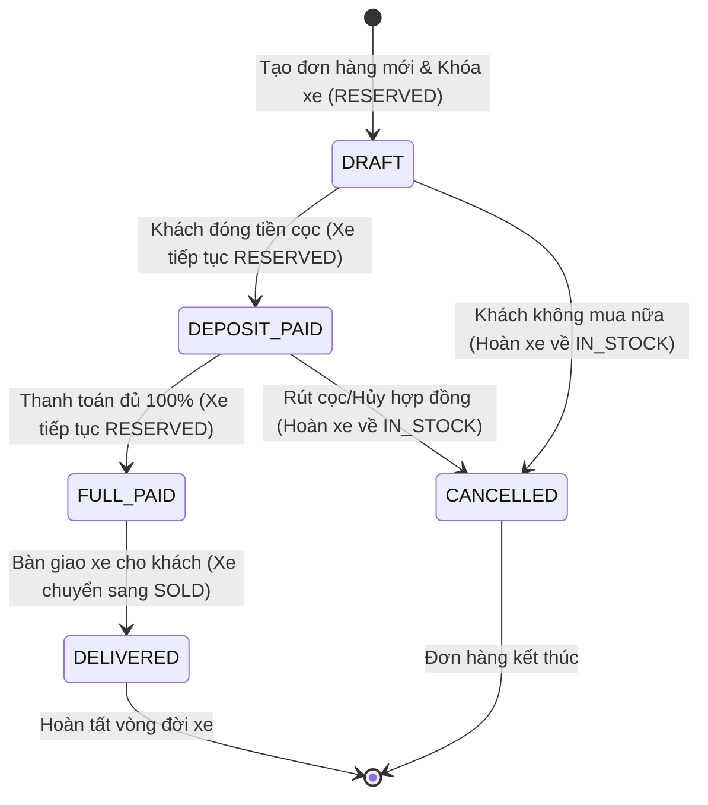

# Kế Hoạch 08: Phân Hệ Bán Hàng & Khách Hàng (CRM & Sales)

## 1. Mục Tiêu & Bối Cảnh Nghiệp Vụ
- **CRM & Sales**: Là trung tâm định hình dòng tiền của doanh nghiệp kinh doanh ô tô với chu kỳ bán hàng dài và giá trị tài sản rất lớn (hàng trăm triệu đến hàng tỷ đồng).
- **Các yêu cầu cốt lõi**:
  1. **Khách hàng cấp tập đoàn (`customers`)**: Dùng chung toàn hệ thống (không bật RLS) để nhận diện khách hàng qua số điện thoại, tích điểm, tra cứu lịch sử mua/sửa xe xuyên suốt tất cả showroom.
  2. **Cơ hội bán hàng (`leads`)**: Phân lập tuyệt đối theo chi nhánh (`branch_id` + RLS). Cho phép 1 khách hàng tạo nhiều lead ở các thời điểm khác nhau (Quan hệ 1-N) để đo lường chính xác tỷ lệ chuyển đổi Marketing.
  3. **Chống Race Condition (Bán trùng số VIN)**: Dùng **Pessimistic Locking (`SELECT ... FOR UPDATE`)** để khóa xe ở cấp Database Row. Hai sales bấm chốt cùng một mili-giây thì người thứ hai sẽ bị từ chối an toàn.
  4. **State Machine Đơn Hàng Nghiêm Ngặt**: Kiểm soát chặt chẽ luồng: `DRAFT` ➡️ `DEPOSIT_PAID` ➡️ `FULL_PAID` ➡️ `DELIVERED`, cấm nhảy cóc trạng thái. Tự động hoàn kho xe (`IN_STOCK`) khi hủy đơn (`CANCELLED`).
  5. **Tính bất biến của giá (Price Immutability)**: Snapshot cố định `total_amount`, `discount_amount`, `deposit_amount` vào đơn hàng tại thời điểm chốt.

---

## 2. Thiết Kế State Machine & Luồng Xử Lý Giao Dịch ACID

### 2.1. Ma Trận Chuyển Trạng Thái Đơn Hàng (Sales Order State Machine)


---

### 2.2. Quy Trình Chống Race Condition Khi Lên Đơn (SELECT FOR UPDATE)
```mermaid
sequenceDiagram
    autonumber
    actor SalesA as Nhân viên Sales 1
    actor SalesB as Nhân viên Sales 2
    participant Store as SQLStore (pgxpool)
    participant PG as PostgreSQL (Row Lock)

    SalesA->>Store: POST /sales-orders (VIN: VF8-12345)
    SalesB->>Store: POST /sales-orders (VIN: VF8-12345)
    
    Note over Store,PG: Transaction A bắt đầu
    Store->>PG: BEGIN TX; SELECT * FROM vehicles WHERE id = $1 FOR UPDATE;
    PG-->>Store: Trả về xe (Status = IN_STOCK). ROW XE ĐƯỢC KHÓA (LOCKED)!
    
    Note over Store,PG: Transaction B cố gắng khóa cùng chiếc xe
    Store->>PG: BEGIN TX; SELECT * FROM vehicles WHERE id = $1 FOR UPDATE;
    Note over PG: Transaction B PHẢI CHỜ (WAITING) cho đến khi TX A xong
    
    Store->>PG: INSERT INTO sales_orders (...);
    Store->>PG: UPDATE vehicles SET status = 'RESERVED' WHERE id = $1;
    Store->>PG: COMMIT TX A;
    
    Note over PG: Lock được giải phóng, TX B tiếp tục chạy
    PG-->>Store: TX B đọc được xe vừa cập nhật (Status = RESERVED)
    Store->>Store: Kiểm tra xe không còn IN_STOCK
    Store-->>SalesB: 409 Conflict / 400 Bad Request: "Xe đã được đặt cọc/bán!"
```

---

## 3. Các Thành Phần Đã Triển Khai

### 🗃️ Data Access Layer (sqlc)
- [`BE/db/query/customers.sql`](file:///d:/project/bad-idea/car-erp/BE/db/query/customers.sql): `CreateCustomer`, `GetCustomer`, `GetCustomerByPhone`, `ListCustomers`, `SearchCustomers`, `UpdateCustomer`.
- [`BE/db/query/leads.sql`](file:///d:/project/bad-idea/car-erp/BE/db/query/leads.sql): `CreateLead`, `GetLead`, `ListLeads`, `ListLeadsByStatus`, `ListLeadsByCustomer` (1-to-N history), `AssignLead`, `UpdateLeadStatus`.
- [`BE/db/query/vehicles.sql`](file:///d:/project/bad-idea/car-erp/BE/db/query/vehicles.sql): Thêm `GetVehicleForUpdate` (`SELECT ... FOR UPDATE`).
- [`BE/db/query/sales_orders.sql`](file:///d:/project/bad-idea/car-erp/BE/db/query/sales_orders.sql): `CreateSalesOrder`, `GetSalesOrder`, `GetSalesOrderForUpdate`, `ListSalesOrders`, `UpdateSalesOrderStatus`, `UpdateSalesOrderDeposit`.

### ⚙️ Domain Logic & State Machine
- [`BE/internal/domain/sales_order_state.go`](file:///d:/project/bad-idea/car-erp/BE/internal/domain/sales_order_state.go):
  - Kiểm soát nghiêm ngặt chuyển đổi trạng thái đơn hàng (`ValidateOrderTransition`).
  - Tự động mapping trạng thái xe tương ứng (`GetVehicleStatusForOrderTransition`).

### 🌐 HTTP Handlers & Router
- [`BE/internal/api/handler/customer_handler.go`](file:///d:/project/bad-idea/car-erp/BE/internal/api/handler/customer_handler.go): Khách hàng tập đoàn dùng chung.
- [`BE/internal/api/handler/lead_handler.go`](file:///d:/project/bad-idea/car-erp/BE/internal/api/handler/lead_handler.go): Cơ hội bán hàng phân lập RLS.
- [`BE/internal/api/handler/sales_order_handler.go`](file:///d:/project/bad-idea/car-erp/BE/internal/api/handler/sales_order_handler.go): Đơn bán xe với khóa hàng bi quan và snapshot giá bất biến.
- [`BE/internal/api/server.go`](file:///d:/project/bad-idea/car-erp/BE/internal/api/server.go): Đăng ký toàn bộ router groups.

---

## 4. Kết Quả Kiểm Thử (Integration Tests)
Đã kiểm thử thực tế tại [`BE/internal/api/sales_test.go`](file:///d:/project/bad-idea/car-erp/BE/internal/api/sales_test.go):
- **`TestStateMachine_Unit`**: **PASS** (Kiểm tra chặn đứng hành vi nhảy cóc trạng thái).
- **`TestCustomer_And_Lead_Lifecycle`**: **PASS** (1 khách hàng có nhiều leads theo thời gian).
- **`TestSalesOrder_RaceCondition_PessimisticLock`**: **PASS** (2 sales cùng chốt 1 số VIN đồng thời -> Chính xác 1 đơn thành công 201, 1 đơn bị từ chối do xe đã bị khóa).
- **`TestSalesOrder_Lifecycle_And_Cancellation`**: **PASS** (Luồng đầy đủ `DRAFT` ➡️ `DEPOSIT_PAID` ➡️ `FULL_PAID` ➡️ `DELIVERED`).
- **`TestSalesOrder_Cancellation_Reverts_Stock`**: **PASS** (Hủy đơn hàng -> Xe tự động hoàn kho `IN_STOCK`).
