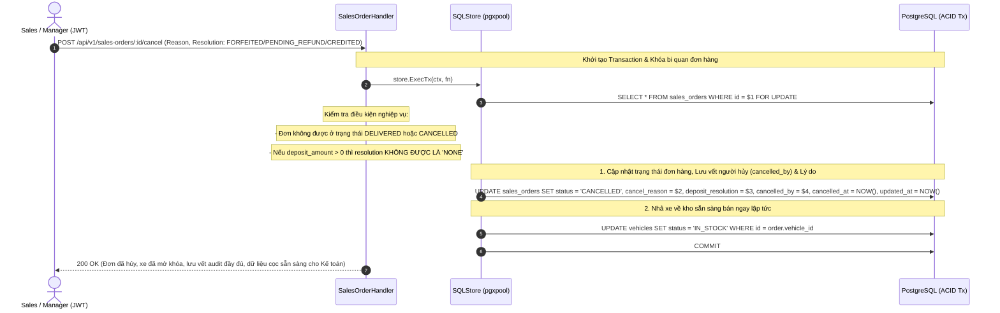

# Kế Hoạch 09: Luồng Hủy Đơn Hàng & Xử Lý Tiền Cọc Kế Toán (Cancellation & Deposit Resolution)

## 1. Mục Tiêu & Bối Cảnh Nghiệp Vụ
- Khi hủy đơn hàng ô tô (`sales_orders`), nghiệp vụ bắt buộc phải **tách bạch hoàn toàn giữa 2 phân hệ**:
  1. **Phân hệ Kho xe (Inventory)**: Ngay lập tức mở khóa chiếc xe từ `RESERVED` về lại `IN_STOCK` để giải phóng tồn kho cho các nhân viên Sales khác có thể chào bán.
  2. **Phân hệ Tài chính - Kế toán (Finance)**: Không xóa sửa lịch sử dòng tiền cũ. Bắt buộc lưu vết `cancel_reason` (lý do hủy), `deposit_resolution` (hướng giải quyết cọc) và **`cancelled_by` (lưu vết ID nhân viên thực hiện hủy từ JWT Token)** để làm căn cứ hạch toán tự động và tra cứu trách nhiệm:
     - `NONE`: Áp dụng cho đơn `DRAFT` chưa phát sinh tiền cọc.
     - `FORFEITED` (Tịch thu cọc): Khách đơn phương bỏ cọc -> Kế toán ghi nhận vào "Thu nhập khác / Doanh thu bất thường".
     - `PENDING_REFUND` (Chờ hoàn tiền): Showroom đồng ý hoàn cọc -> Kế toán xuất lệnh chi tiền (Bank Transfer/Tiền mặt) và chuyển sang `REFUNDED`.
     - `CREDITED` (Bảo lưu cọc): Giữ cọc để cấn trừ vào đơn hàng mua xe khác tiếp theo.

---

## 2. Thiết Kế Luồng Hủy Đơn & State Flow

---

## 3. Các Thành Phần Đã Triển Khai

### 🗄️ Database Migration
- [`BE/db/migration/000004_add_sales_order_cancellation_fields.up.sql`](file:///d:/project/bad-idea/car-erp/BE/db/migration/000004_add_sales_order_cancellation_fields.up.sql): Thêm các trường `cancel_reason TEXT`, `deposit_resolution VARCHAR(50)`, `cancelled_by UUID REFERENCES employees(id)`, `cancelled_at TIMESTAMPTZ`.
- Thực thi Migration: `4/u add_sales_order_cancellation_fields` ✅ Thành công.

### 📝 SQLC Queries
- [`BE/db/query/sales_orders.sql`](file:///d:/project/bad-idea/car-erp/BE/db/query/sales_orders.sql): Query `CancelSalesOrder` cập nhật `status = 'CANCELLED'`, `cancel_reason`, `deposit_resolution`, `cancelled_by`, `cancelled_at`.

### ⚙️ Domain Logic & HTTP Handler
- [`BE/internal/domain/sales_order_state.go`](file:///d:/project/bad-idea/car-erp/BE/internal/domain/sales_order_state.go): Hằng số `DepositResolution` và hàm `ValidateCancellation` kèm `ValidationError` trả về lỗi 400 Bad Request.
- [`BE/internal/api/handler/sales_order_handler.go`](file:///d:/project/bad-idea/car-erp/BE/internal/api/handler/sales_order_handler.go): `CancelSalesOrder` trích xuất `payload.UserID` từ JWT token để ghi vào `cancelled_by`.
- [`BE/internal/api/server.go`](file:///d:/project/bad-idea/car-erp/BE/internal/api/server.go): Đăng ký route `POST /api/v1/sales-orders/:id/cancel`.

---

## 4. Kết Quả Kiểm Thử (Integration Tests)
Đã kiểm thử thực tế tại [`BE/internal/api/sales_test.go`](file:///d:/project/bad-idea/car-erp/BE/internal/api/sales_test.go):
- **`TestSalesOrder_Cancellation_With_Audit_And_Resolutions`**: **PASS** (0.34s)
  1. Đơn có tiền cọc nhưng cố tình chọn `deposit_resolution = NONE` ➡️ Bị chặn với mã lỗi `400 Bad Request`.
  2. Hủy đơn hợp lệ với `deposit_resolution = FORFEITED` (Tịch thu cọc) ➡️ Thành công `200 OK`.
  3. Xác thực trường `cancelled_by` được ghi nhận chính xác theo Employee ID của người gửi JWT Token.
  4. Chiếc xe liên kết ngay lập tức được mở khóa hoàn về kho `IN_STOCK`.
