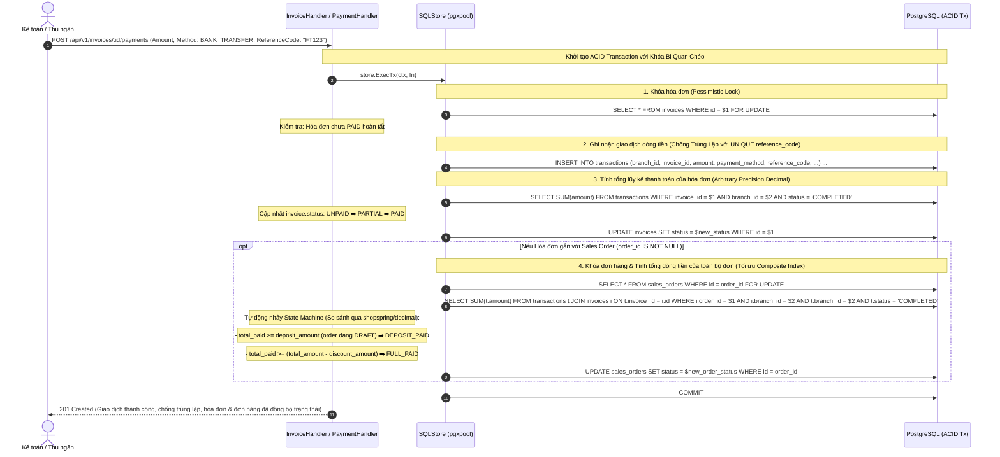

# Kế Hoạch 10: Phân Hệ Tài Chính - Hóa Đơn & Thanh Toán (Finance: Invoices & Payments)

## 1. Mục Tiêu & Bối Cảnh Nghiệp Vụ
- Trong ngành ô tô, giá trị tài sản rất lớn và khách hàng thường chia làm nhiều đợt thanh toán:
  1. **Đợt 1: Đặt cọc (Deposit)** để giữ xe và làm thủ tục hợp đồng / hồ sơ vay ngân hàng.
  2. **Đợt 2: Giải ngân ngân hàng hoặc thanh toán số tiền còn lại** trước khi làm thủ tục đăng ký xe và bàn giao.
- **Mục tiêu cốt lõi của Phân hệ Finance**:
  - **Quản lý Hóa đơn (`invoices`)**: Xuất hóa đơn cọc, hóa đơn thanh toán từng đợt gắn chặt với `sales_orders` (và sau này `repair_orders`). Bảo vệ bằng PostgreSQL RLS theo chi nhánh.
  - **Ghi nhận Dòng tiền thực tế (`transactions`)**: Mỗi lần thu tiền mặt, chuyển khoản ngân hàng (Bank Transfer) hoặc thanh toán trả góp (Installment) sinh ra bản ghi `transactions`.
  - **Độ chính xác tiền tệ tuyệt đối (Currency Precision)**: Sử dụng thư viện `github.com/shopspring/decimal` cho toàn bộ các phép so sánh, cộng trừ lũy kế thay vì `float64` để loại bỏ 100% sai số dấu phẩy động.
  - **Tính Lũy Đẳng (Idempotency Key / Reference Code)**: Bổ sung trường `reference_code VARCHAR(100) UNIQUE` trong bảng `transactions` để chặn đứng các giao dịch gửi đúp (double-click hoặc client network retry).
  - **Tối ưu hóa Truy vấn Dòng tiền & Index**: Sử dụng Composite Index (`idx_invoices_order_branch`, `idx_transactions_invoice_branch`) và lọc `branch_id` trực tiếp trong câu lệnh `SUM` để PostgreSQL Query Planner quét Index Scan nhanh nhất khi dữ liệu phình to.
  - **Tự động hóa State Machine Đơn hàng (Cross-Module State Synchronization)**:
    - Khi tổng số tiền thanh toán cho hóa đơn cọc $\ge$ `deposit_amount`: Đơn hàng tự động nhảy từ `DRAFT` ➡️ `DEPOSIT_PAID`.
    - Khi tổng số tiền thanh toán toàn bộ các hóa đơn $\ge$ `total_amount - discount_amount`: Đơn hàng tự động nhảy sang `FULL_PAID`.
    - **Delivery Guard**: Chỉ khi đơn hàng đạt `FULL_PAID` thì hệ thống mới cho phép chuyển sang `DELIVERED` (Bàn giao xe & chuyển xe sang `SOLD`).

---

## 2. Thiết Kế Luồng Xử Lý Giao Dịch ACID & Đồng Bộ Trạng Thái

---

## 3. Các Thành Phần Đã Triển Khai

### 🗄️ Database Migrations
- [`BE/db/migration/000005_add_finance_indexes.up.sql`](file:///d:/project/bad-idea/car-erp/BE/db/migration/000005_add_finance_indexes.up.sql): Composite Index tối ưu truy vấn dòng tiền.
- [`BE/db/migration/000006_add_transaction_reference_code.up.sql`](file:///d:/project/bad-idea/car-erp/BE/db/migration/000006_add_transaction_reference_code.up.sql): Bổ sung `reference_code VARCHAR(100) UNIQUE` cho bảng `transactions`.
- Cả 2 migrations đã thực thi lên PostgreSQL Database thành công ✅.

### 📝 SQLC Queries Tối Ưu Hóa & Lũy Đẳng
- [`BE/db/query/invoices.sql`](file:///d:/project/bad-idea/car-erp/BE/db/query/invoices.sql)
- [`BE/db/query/transactions.sql`](file:///d:/project/bad-idea/car-erp/BE/db/query/transactions.sql): Bổ sung `reference_code` vào `CreateTransaction`, `GetTransactionByReferenceCode`.

### ⚙️ Domain Logic & HTTP Handler
- [`BE/internal/domain/finance.go`](file:///d:/project/bad-idea/car-erp/BE/internal/domain/finance.go): Hằng số trạng thái hóa đơn, giao dịch, phương thức thanh toán.
- [`BE/internal/api/handler/invoice_handler.go`](file:///d:/project/bad-idea/car-erp/BE/internal/api/handler/invoice_handler.go):
  - Ánh xạ tiền tệ bằng `shopspring/decimal` (loại bỏ hoàn toàn sai số `float64`).
  - Ghi nhận `reference_code` để database chặn tự động các lệnh trùng lặp với `409 Conflict`.
- [`BE/internal/api/server.go`](file:///d:/project/bad-idea/car-erp/BE/internal/api/server.go): Đăng ký các router `/invoices` và `/transactions`.

---

## 4. Kết Quả Kiểm Thử (Integration Tests)
Đã kiểm thử thực tế tại [`BE/internal/api/finance_test.go`](file:///d:/project/bad-idea/car-erp/BE/internal/api/finance_test.go):
- **`TestInvoice_Creation_And_RLS`**: **PASS** (0.33s)
- **`TestFinance_AutomatedStateMachine_And_DeliveryGuard`**: **PASS** (0.42s)
  1. Tạo đơn hàng 1.1 Tỷ, Cọc 50 Triệu (`DRAFT`).
  2. Thu cọc đợt 1 với `reference_code` ➡️ Thành công.
  3. Cố tình gửi lại cùng `reference_code` ➡️ **Bị DB Unique chặn đứng với HTTP `409 Conflict` (Idempotency verified)**!
  4. Thu nốt tiền cọc ➡️ Đơn hàng tự động nhảy sang `DEPOSIT_PAID`.
  5. Cố tình bàn giao xe khi chưa thanh toán 100% ➡️ Bị chặn với lỗi `400 Bad Request` (Delivery Guard).
  6. Xuất hóa đơn đợt 2 & Thu 1.05 Tỷ còn lại ➡️ Đơn hàng tự động nhảy sang `FULL_PAID`.
  7. Bàn giao xe (`DELIVERED`) thành công ➡️ Chiếc xe trong kho chuyển sang `SOLD`.
