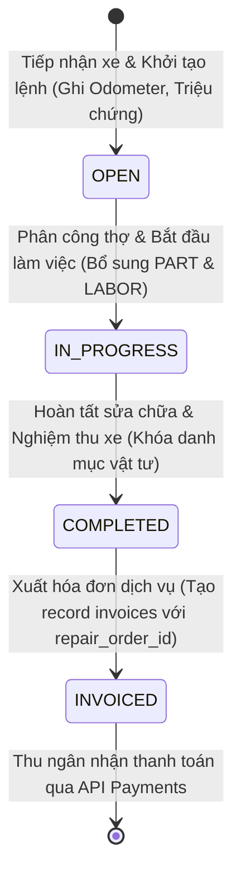

# Kế Hoạch 11: Phân Hệ Dịch Vụ & Sau Bán Hàng (After-Sales Service)

## 1. Mục Tiêu & Bối Cảnh Nghiệp Vụ
- Sau khi bán xe, **Dịch vụ bảo dưỡng & Sửa chữa (After-Sales Service)** là nguồn doanh thu định kỳ, biên lợi nhuận cao và mang lại nguồn dữ liệu quý giá (Odometer, lịch sử hỏng hóc, chu kỳ thay phụ tùng) để huấn luyện mô hình AI dự đoán bảo trì xe sau này.
- **Mục tiêu cốt lõi của Phân hệ Service**:
  1. **Tiếp nhận & Quản lý Lệnh Sửa Chữa (`repair_orders`)**:
     - Gắn chặt với `vehicle_id` (xe đã bán trong hệ thống) và `customer_id`.
     - Phân công Cố vấn dịch vụ (`service_advisor_id`) và Kỹ thuật viên chính (`mechanic_id`) tham chiếu chuẩn tới `employees.id`.
     - Ghi nhận triệu chứng (`symptoms`), chẩn đoán kỹ thuật (`diagnosis`) và **Số Kilomet hiện tại (`odometer`)**.
     - **Kiểm soát tính toàn vẹn Odometer (Odometer Guard)**: Số ODO mới bắt buộc phải $\ge$ số ODO của lần vào xưởng gần nhất (chống gian lận / tua lùi công-tơ-mét).
     - **Cửa Hậu Cho Lỗi Gõ Nhầm ODO (Odometer Override)**: Cho phép `branch_manager` hoặc `superadmin` bypass quy tắc kiểm tra ODO khi có giải trình hợp lệ ($\ge$ 10 ký tự) và lưu vết vào `odometer_override_reason`.
  2. **Bóc Tách Vật Tư & Công Thợ (`repair_order_items`)**:
     - Phân loại rõ ràng `item_type`:
       - `PART`: Phụ tùng / Linh kiện xuất kho (dầu nhớt, má phanh, lọc gió...). Hỗ trợ `part_id` dự phòng mở rộng cho kho phụ tùng tương lai.
       - `LABOR`: Tiền công thợ theo định mức giờ công chuẩn.
     - **Tính Nguyên Tử Khi Cập Nhật `total_cost` (Race Condition Protection)**: Câu lệnh `RecalculateRepairOrderTotalCost` tính toán và cập nhật lại `total_cost` trực tiếp dưới Database trong Transaction kèm Khóa bi quan (`SELECT ... FOR UPDATE`), loại bỏ 100% nguy cơ ghi đè khi nhiều thợ cùng thêm vật tư cùng lúc.
  3. **Vòng Đời Trạng Thái Lệnh Sửa Chữa (Service State Machine)**:
     - `OPEN`: Mới tiếp nhận xe, lập danh mục vật tư & chẩn đoán.
     - `IN_PROGRESS`: Kỹ thuật viên bắt đầu sửa chữa / bảo dưỡng.
     - `COMPLETED`: Hoàn tất kỹ thuật, nghiệm thu xe đạt chuẩn (bắt buộc có ít nhất 1 item và `total_cost > 0`). Khi đã `COMPLETED`, hệ thống **khóa danh mục vật tư** không cho thêm/xóa/sửa.
     - `INVOICED`: Đã xuất hóa đơn thanh toán cho khách hàng.
  4. **Tích Hợp Chéo Liền Mạch Với Finance**:
     - Khi lệnh sửa chữa ở trạng thái `COMPLETED`, cho phép xuất Hóa đơn (`invoices`) trỏ về `repair_order_id`.
     - Tái sử dụng 100% API Thanh toán (`POST /api/v1/invoices/:id/payments`) với đầy đủ tính năng Idempotency và Decimal Precision.

---

## 2. Thiết Kế Luồng Nghiệp Vụ & State Machine

---

## 3. Các Thành Phần Đã Triển Khai

### 🗄️ Database Migrations
- [`BE/db/migration/000007_add_service_fields_and_indexes.up.sql`](file:///d:/project/bad-idea/car-erp/BE/db/migration/000007_add_service_fields_and_indexes.up.sql):
  - `odometer_override_reason TEXT` trong `repair_orders`
  - `part_id UUID` trong `repair_order_items`
  - Composite indexes: `idx_repair_orders_vehicle_created`, `idx_repair_orders_branch_status`, `idx_repair_order_items_order`, `idx_invoices_repair_order_branch`
  - Migration thực thi thành công lên PostgreSQL Database ✅.

### 📝 SQLC Queries Tối Ưu & Atomic Recalculation
- [`BE/db/query/repair_orders.sql`](file:///d:/project/bad-idea/car-erp/BE/db/query/repair_orders.sql): `CreateRepairOrder`, `GetRepairOrder`, `GetRepairOrderForUpdate`, `GetLatestOdometerForVehicle`, `ListRepairOrders`, `ListRepairOrdersByVehicle`, `UpdateRepairOrderStatus`, `AssignMechanic`, `RecalculateRepairOrderTotalCost`.
- [`BE/db/query/repair_order_items.sql`](file:///d:/project/bad-idea/car-erp/BE/db/query/repair_order_items.sql): `CreateRepairOrderItem`, `GetRepairOrderItem`, `ListRepairOrderItemsByOrder`, `DeleteRepairOrderItem`.

### ⚙️ Domain Logic & HTTP Handler
- [`BE/internal/domain/service_state.go`](file:///d:/project/bad-idea/car-erp/BE/internal/domain/service_state.go): Quản lý State Machine dịch vụ, Odometer validation & Branch Manager override, Item modification validation.
- [`BE/internal/api/handler/repair_order_handler.go`](file:///d:/project/bad-idea/car-erp/BE/internal/api/handler/repair_order_handler.go):
  - `POST /api/v1/repair-orders`: Mở lệnh sửa chữa với Odometer Guard.
  - `GET /api/v1/repair-orders`: Danh sách lệnh sửa chữa (RLS chi nhánh).
  - `GET /api/v1/repair-orders/:id`: Chi tiết lệnh sửa chữa kèm danh mục PART & LABOR.
  - `GET /api/v1/repair-orders/vehicle/:vehicle_id/history`: Lịch sử bảo dưỡng của xe (Dữ liệu huấn luyện AI).
  - `PATCH /api/v1/repair-orders/:id/status`: Chuyển trạng thái lệnh sửa chữa.
  - `PATCH /api/v1/repair-orders/:id/assign-mechanic`: Phân công kỹ thuật viên chính.
  - `POST /api/v1/repair-orders/:id/items`: Thêm linh kiện (`PART`) hoặc công thợ (`LABOR`) với tính toán `total_cost` nguyên tử dưới DB.
  - `DELETE /api/v1/repair-orders/:id/items/:item_id`: Xóa vật tư/công thợ khi đơn đang ở `OPEN` hoặc `IN_PROGRESS`.
  - `POST /api/v1/repair-orders/:id/invoice`: Xuất hóa đơn thu tiền cho lệnh sửa chữa `COMPLETED`.
- [`BE/internal/api/server.go`](file:///d:/project/bad-idea/car-erp/BE/internal/api/server.go): Đăng ký toàn bộ router `/repair-orders`.

---

## 4. Kết Quả Kiểm Thử (Integration Tests)
Đã kiểm thử thực tế tại [`BE/internal/api/service_test.go`](file:///d:/project/bad-idea/car-erp/BE/internal/api/service_test.go):
- **`TestService_OdometerGuard_And_BranchManagerOverride`**: **PASS** (0.31s)
  1. Tiếp nhận xe lần 1 với ODO 10,000 km ➡️ Thành công (201 Created).
  2. Tiếp nhận xe lần 2 với ODO 8,000 km không override ➡️ Bị chặn với lỗi `400 Bad Request` (Odometer Guard).
  3. Cố vấn dịch vụ thường cố tình override ➡️ Bị từ chối `400 Bad Request` (Chặn quyền).
  4. Quản lý chi nhánh (`branch_manager`) override ODO kèm lý do giải trình ➡️ Thành công (201 Created).
- **`TestService_Items_AtomicTotalCost_And_FinancePaymentFlow`**: **PASS** (0.58s)
  1. Thêm `PART` (Dầu động cơ 1.2 Triệu) và `LABOR` (Công bảo dưỡng 250k).
  2. Database tự động cộng dồn `total_cost` nguyên tử = 1,450,000đ.
  3. Chuyển trạng thái: `OPEN` ➡️ `IN_PROGRESS` ➡️ `COMPLETED`.
  4. Cố tình sửa/thêm vật tư khi lệnh đã `COMPLETED` ➡️ Bị chặn `400 Bad Request`.
  5. Xuất hóa đơn dịch vụ ➡️ Sinh ra hóa đơn 1,450,000đ gắn `repair_order_id`, lệnh chuyển sang `INVOICED`.
  6. Thanh toán qua Finance API với `reference_code` ➡️ Hóa đơn chuyển sang `PAID`.
  7. Truy vấn lịch sử bảo dưỡng xe qua `/vehicle/:id/history` ➡️ Trả về toàn bộ dữ liệu lịch sử chuẩn xác.
