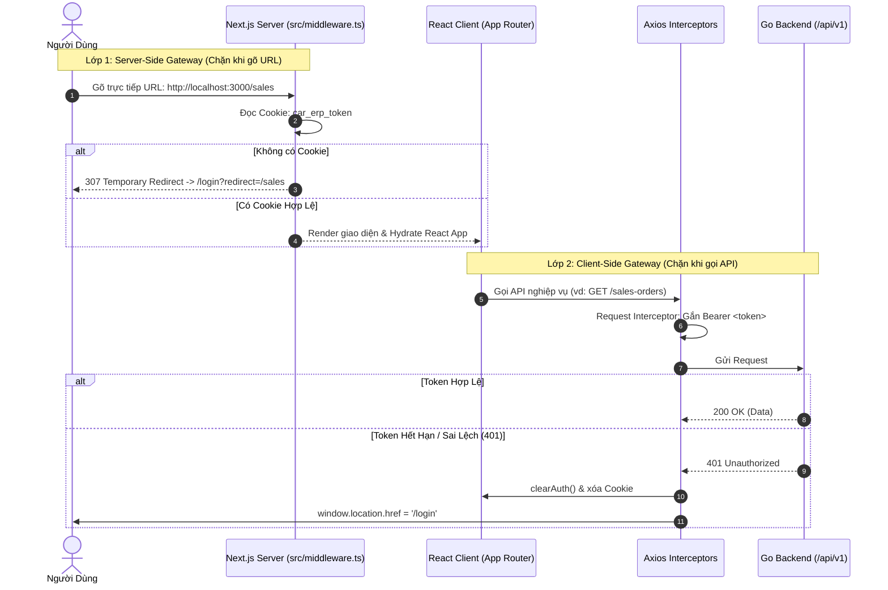

# 13. Kế Hoạch Xác Thực JWT, Zustand Persist, Axios Interceptors & Next.js Server Middleware

Tài liệu này đặc tả quy trình triển khai phân hệ Xác thực (Authentication), Lưu trữ trạng thái toàn cục (Zustand Persist), Kết nối bảo mật API (Axios Interceptors) và **Chốt chặn Server-Side Gateway (Next.js Middleware)** cho Frontend.

---

## 🎯 1. Mục Tiêu & Yêu Cầu Kỹ Thuật

1. **Global Auth Store (`useAuthStore`)**:
   - Lưu trữ 3 trạng thái cốt lõi: `user` (id, username, role, branch_id), `accessToken`, `refreshToken` và cờ `isAuthenticated`.
   - Kết hợp middleware `persist` từ `zustand/middleware` để lưu an toàn vào `localStorage`.
   - Đồng bộ tự động `accessToken` vào Cookie `car_erp_token` để Server Middleware đọc được.
2. **Axios Client & Interceptors (Client-Side Gateway)**:
   - **Request Interceptor**: Tự động lấy `accessToken` từ `useAuthStore` và gắn vào Header `Authorization: Bearer <token>`.
   - **Response Interceptor**: Bắt mã lỗi HTTP `401 Unauthorized`. Tự động xóa phiên đăng nhập (`clearAuth()`) và điều hướng người dùng ra màn hình đăng nhập (`window.location.href = '/login'`).
3. **Next.js Server Middleware (`src/middleware.ts` - Server-Side Gateway)**:
   - **Chốt chặn số 1**: Người dùng chưa đăng nhập khi gõ trực tiếp URL (`/`, `/inventory`, `/sales`...) trên thanh địa chỉ sẽ bị Next.js Middleware chặn đứng ngay từ tầng Server render và chuyển hướng về `/login?redirect=...` trước khi React kịp khởi chạy.
   - **Chốt chặn số 2**: Người dùng đã đăng nhập khi truy cập `/login` sẽ tự động được điều hướng vào Dashboard (`/`).
4. **Màn hình Đăng nhập (`LoginForm`)**:
   - Tích hợp **React Hook Form** + **Zod Schema** để validate client-side chặt chẽ.
   - Giao diện thiết kế theo chuẩn **Shadcn UI** (`Card`, `Input`, `Button`, `Alert`).
   - Gọi API `POST /api/v1/auth/login`, ghi nhận session vào Zustand + Cookie, và điều hướng vào Dashboard hoặc URL ban đầu qua `useRouter().push(redirectUrl)`.

---

## 🏛️ 2. Thiết Kế Hai Lớp Chốt Chặn Bảo Mật (Two-Tier Security Gateway)

---

## ⚡ 3. Các Bước Triển Khai

1. **Khởi tạo Next.js Middleware (`src/middleware.ts`)**:
   - Kiểm tra `car_erp_token` từ request cookies.
   - Redirect về `/login?redirect=${pathname}` nếu chưa có token.
   - Redirect về `/` nếu đã có token mà truy cập `/login`.
2. **Cấu hình Cookie Sync trong `auth-store.ts`**:
   - Khi `setAuth(...)`: Ghi cookie `car_erp_token` với `max-age=604800` (7 ngày).
   - Khi `clearAuth()` / `logout()`: Xóa cookie `car_erp_token`.
3. **LoginForm hỗ trợ Redirect URL**:
   - Đọc query params `redirect` từ `useSearchParams()`.
   - Điều hướng người dùng tới trang ban đầu sau khi đăng nhập thành công.

---

## 🧪 4. Kế Hoạch Kiểm Thử

- Thử gõ `http://localhost:3000/` khi chưa đăng nhập -> Middleware tự động chuyển sang `http://localhost:3000/login?redirect=/`.
- Đăng nhập thành công -> Lưu cookie & token, chuyển hướng vào `/`.
- Thử gõ `http://localhost:3000/login` khi đã đăng nhập -> Middleware tự động chuyển sang `/`.
- `npm run build`: Kiểm tra middleware build thành công (`ƒ Proxy (Middleware)`).
